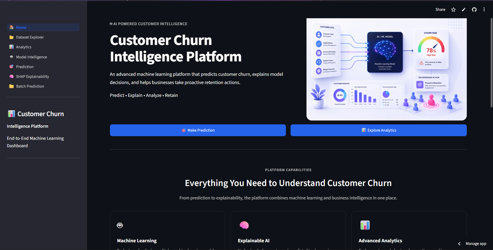
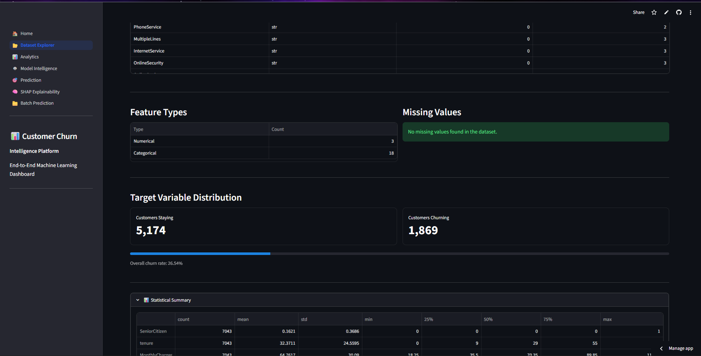
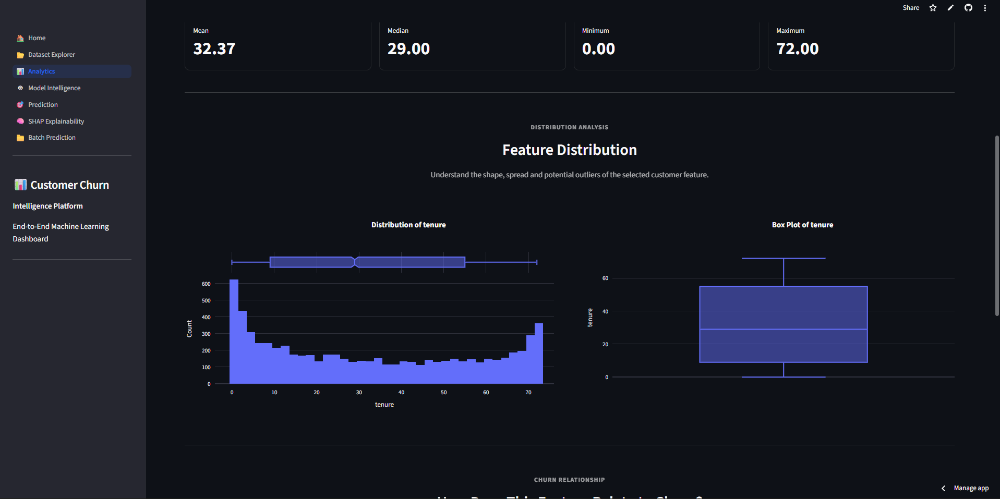
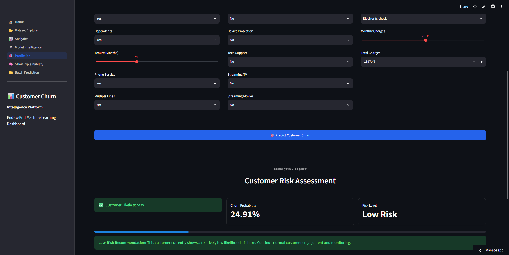
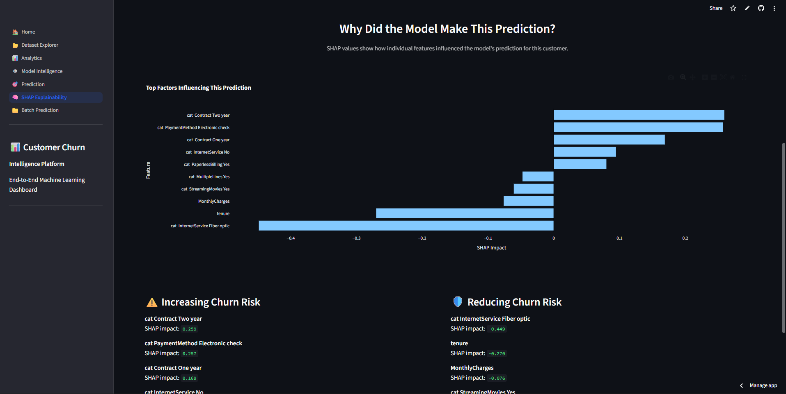
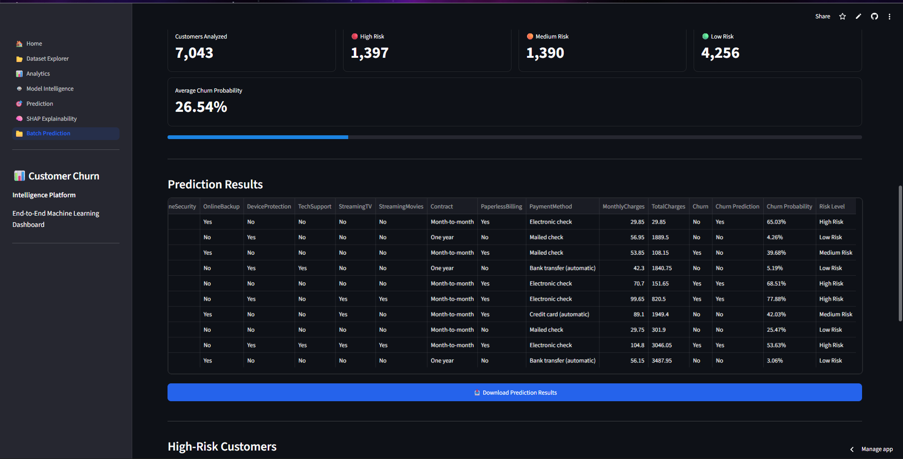

# 📊 Customer Churn Intelligence Platform

An end-to-end machine learning platform for **customer churn prediction, explainable AI, customer risk assessment, and business intelligence**.

The project takes the complete machine learning workflow from data understanding and exploratory analysis to feature engineering, model training, hyperparameter tuning, model comparison, explainability, and deployment as an interactive Streamlit application.

## 🚀 Live Application

🔗 **[Customer Churn Intelligence Platform](https://customerchurnintelligenceplatform.streamlit.app/)**

The deployed application allows users to:

- Explore the customer churn dataset
- Perform interactive exploratory data analysis
- Compare machine learning models
- Predict churn for individual customers
- Analyze prediction explanations using SHAP
- Perform batch churn prediction using CSV files
- Identify high-risk customers
- Download batch prediction results

---

## ⚙️ Setup & Installation

For complete instructions on setting up the project locally, installing dependencies, running the Streamlit application, working with the notebooks, testing, and deployment:

👉 **[Read the Complete Setup Guide](SETUP.md)**


---


# 🎯 Project Overview

Customer churn is a major business problem where customers discontinue their services or subscriptions.

The goal of this project is to build an intelligent system that can:

1. Understand customer behavior
2. Identify patterns associated with churn
3. Train multiple machine learning models
4. Optimize model performance
5. Predict the probability of customer churn
6. Classify customers according to risk
7. Explain individual predictions using SHAP
8. Support batch prediction for multiple customers
9. Provide an interactive business-oriented dashboard

Instead of building only a machine learning model, this project focuses on creating a **complete end-to-end ML application**.

---

# ✨ Key Features

## 📂 Dataset Explorer

Explore the customer churn dataset through an interactive interface.

Features include:

- Dataset dimensions
- Data preview
- Feature information
- Numerical and categorical feature analysis
- Missing-value analysis
- Dataset statistics

---

## 📊 Interactive EDA

The platform provides interactive analytics for understanding customer behavior.

Analysis includes:

- Churn distribution
- Categorical feature analysis
- Numerical feature distributions
- Customer tenure analysis
- Monthly charges analysis
- Total charges analysis
- Contract-based churn analysis
- Internet service analysis
- Payment method analysis
- Customer demographic patterns

Interactive visualizations are built using Plotly and other Python visualization libraries.

---

## 🤖 Model Intelligence

Multiple machine learning algorithms were trained and evaluated.

The project includes:

- Logistic Regression
- Decision Tree
- Random Forest
- XGBoost

Both baseline and hyperparameter-tuned versions were evaluated.

---

## 🎯 Individual Customer Prediction

Users can enter customer information through the web interface and receive:

- Churn prediction
- Churn probability
- Customer risk level
- Retention recommendation

Risk levels are categorized into:

- 🟢 Low Risk
- 🟠 Medium Risk
- 🔴 High Risk

---

## 🧠 Explainable AI with SHAP

The platform uses **SHAP (SHapley Additive exPlanations)** to explain individual machine learning predictions.

The explainability interface shows:

- Features influencing the prediction
- Positive impact on churn risk
- Negative impact on churn risk
- SHAP impact values
- Top factors influencing the prediction

This makes the model more interpretable and helps users understand **why a customer was predicted to churn**.

---

## 📁 Batch Prediction

Users can upload a customer CSV file and generate predictions for multiple customers at once.

The batch prediction system provides:

- Number of customers analyzed
- Churn predictions
- Churn probabilities
- Risk levels
- High-risk customer identification
- Risk distribution visualization
- Prediction results table
- CSV download functionality

---

# 🧠 Machine Learning Workflow

The project follows a complete machine learning pipeline:

```text
Business & Data Understanding
            ↓
Exploratory Data Analysis
            ↓
Feature Engineering
            ↓
Data Preprocessing
            ↓
Baseline Model Training
            ↓
Model Evaluation
            ↓
Hyperparameter Tuning
            ↓
Final Model Comparison
            ↓
Model Selection
            ↓
SHAP Explainability
            ↓
Customer Prediction
            ↓
Batch Prediction
            ↓
Streamlit Deployment
```


---

## 🎯 Problem Statement

Customer churn is a major business challenge for subscription-based and service-oriented companies. Losing customers can significantly affect revenue and long-term customer relationships.

The objective of this project is to develop a machine learning system that predicts whether a customer is likely to churn based on demographic, service, contract, and billing information.

The platform goes beyond simple prediction by providing:

- Churn probability
- Customer risk classification
- Model comparison
- Interactive customer analytics
- SHAP-based prediction explanations
- Batch prediction for multiple customers


## 🎯 Project Objectives

- Understand customer churn patterns through exploratory data analysis
- Perform feature engineering and preprocessing
- Develop multiple machine learning models
- Compare baseline models
- Perform hyperparameter tuning
- Select the best-performing model
- Generate customer churn probabilities
- Classify customers according to churn risk
- Explain individual predictions using SHAP
- Build an interactive Streamlit dashboard
- Support batch prediction through CSV upload
- Deploy the application for public access

---

## 📊 Dataset

The project uses the Telco Customer Churn dataset containing customer demographic, service, contract, and billing information.

The dataset contains approximately 7,000 customer records and includes both numerical and categorical variables.

### Target Variable

`Churn`

The target represents whether a customer discontinued the service.

- `Yes` → Customer churned
- `No` → Customer did not churn


## 🧾 Dataset Features

### Customer Information

- Gender
- SeniorCitizen
- Partner
- Dependents

### Service Information

- Tenure
- PhoneService
- MultipleLines
- InternetService
- OnlineSecurity
- OnlineBackup
- DeviceProtection
- TechSupport
- StreamingTV
- StreamingMovies

### Contract & Billing Information

- Contract
- PaperlessBilling
- PaymentMethod
- MonthlyCharges
- TotalCharges

### Target

- Churn

---


## 📓 Machine Learning Notebooks

The complete machine learning development process is documented through Jupyter notebooks.

| Notebook | Description |
|---|---|
| `01_Business_and_Data_Understanding.ipynb` | Business problem, dataset understanding and initial investigation |
| `02_Exploratory_Data_Analysis.ipynb` | Exploratory analysis and churn pattern investigation |
| `03_Feature_Engineering.ipynb` | Data cleaning, transformation and feature preparation |
| `04_Logistic_Regression.ipynb` | Logistic Regression model development |
| `05_Decision_Tree.ipynb` | Decision Tree model development |
| `06_Random_Forest.ipynb` | Random Forest model development |
| `07_XGBoost.ipynb` | XGBoost model development |
| `08_Baseline_Model_Comparison.ipynb` | Comparison of baseline models |
| `09_Logistic_Regression_Tuning.ipynb` | Logistic Regression hyperparameter tuning |
| `10_Decision_Tree_Tuning.ipynb` | Decision Tree hyperparameter tuning |
| `11_Random_Forest_Tuning.ipynb` | Random Forest hyperparameter tuning |
| `12_XGBoost_Tuning.ipynb` | XGBoost hyperparameter tuning |
| `13_Final_Model_Comparison.ipynb` | Final comparison of tuned models |
| `14_Model_Explainability_SHAP.ipynb` | SHAP-based model explainability |

---

## 🤖 Model Performance

The following models were evaluated using Accuracy, Precision, Recall, F1 Score and ROC-AUC.

| Model | Accuracy | Precision | Recall | F1 Score | ROC-AUC |
|---|---:|---:|---:|---:|---:|
| Logistic Regression | 0.7967 | 0.6375 | 0.5455 | 0.5879 | 0.8305 |
| Decision Tree | 0.7271 | 0.4870 | 0.5000 | 0.4934 | 0.6561 |
| Random Forest | 0.7832 | 0.6237 | 0.4652 | 0.5329 | 0.8068 |
| XGBoost | 0.7861 | 0.6189 | 0.5080 | 0.5580 | 0.8047 |
| Logistic Regression (Tuned) | 0.7974 | 0.6395 | 0.5455 | 0.5887 | 0.8304 |
| Decision Tree (Tuned) | 0.7839 | 0.6577 | 0.3904 | 0.4899 | 0.8154 |
| Random Forest (Tuned) | 0.7939 | 0.6579 | 0.4679 | 0.5469 | 0.8318 |
| XGBoost (Tuned) | 0.7918 | 0.6494 | 0.4706 | 0.5457 | 0.8346 |


### 🏆 Best Model

Based on ROC-AUC, the tuned XGBoost model achieved the highest score:

**ROC-AUC: 0.8346**

Therefore, the tuned XGBoost model was selected as the best-performing model for the deployed prediction system.


## 🧠 Explainable AI

The project uses SHAP (SHapley Additive exPlanations) to make individual model predictions more interpretable.

For an individual customer prediction, the platform identifies the features that contributed most strongly to the prediction.

The SHAP interface provides:

- Top factors influencing the prediction
- Features increasing churn risk
- Features reducing churn risk
- SHAP impact values
- Visual explanation of model behavior

This allows users to move from:

> "The model predicts churn"

to:

> "The model predicts churn because these customer characteristics are contributing to the prediction."
---

## ⚠️ Customer Risk Classification

Customers are categorized based on predicted churn probability:

| Churn Probability | Risk Level |
|---:|---|
| < 50% | 🟢 Low Risk |
| 50% – <75% | 🟠 Medium Risk |
| ≥ 75% | 🔴 High Risk |

The risk classification is intended as a decision-support mechanism rather than a definitive business decision.

---

## 🖥️ Application Pages

### 🏠 Home

Provides an overview of the platform, capabilities, ML workflow and key metrics.

### 📂 Dataset Explorer

Allows users to inspect the dataset and understand its structure.

### 📊 Analytics

Provides interactive exploratory analysis of customer churn patterns.

### 🤖 Model Intelligence

Displays machine learning model comparison and performance metrics.

### 🎯 Customer Prediction

Allows users to enter individual customer information and receive a churn prediction, probability and risk assessment.

### 🧠 SHAP Explainability

Explains the factors influencing the previously generated customer prediction.

### 📁 Batch Prediction

Allows users to upload customer CSV data and generate predictions for multiple customers.


## 🏗️ Application Architecture

```text
                    Customer Dataset
                           │
                           ▼
                Data Processing Pipeline
                           │
                           ▼
                 Trained ML Models
                           │
                           ▼
              Model + Preprocessor Files
                           │
                           ▼
                 Streamlit Application
                           │
          ┌────────────────┼────────────────┐
          │                │                │
          ▼                ▼                ▼
    Individual        Batch Prediction   Analytics
    Prediction              │
          │                 │
          ▼                 ▼
      SHAP Analysis     Risk Analysis
          │
          ▼
       Business Insight
```


   

# 15. Technology stack

## 🛠️ Technology Stack

### Programming

- Python

### Data Analysis

- Pandas
- NumPy

### Visualization

- Matplotlib
- Seaborn
- Plotly

### Machine Learning

- Scikit-learn
- XGBoost

### Explainable AI

- SHAP

### Application

- Streamlit

### Development

- Jupyter Notebook
- VS Code
- Git
- GitHub

### Deployment

- Streamlit Community Cloud
---


## 📁 Project Structure

Customer_Churn_Intelligence_Platform/
│
├── app.py
├── requirements.txt
├── README.md
├── .gitignore
│
├── assets/
│   ├── images/
│   ├── icons/
│   └── styles/
│
├── data/
│   ├── raw/
│   └── processed/
│
├── models/
│   ├── tuned/
│   ├── best_model.pkl
│   ├── preprocessor.pkl
│   ├── logistic_regression.pkl
│   ├── decision_tree.pkl
│   ├── random_forest.pkl
│   └── xgboost.pkl
│
├── notebooks/
│   ├── 01_Business_and_Data_Understanding.ipynb
│   ├── 02_Exploratory_Data_Analysis.ipynb
│   ├── 03_Feature_Engineering.ipynb
│   ├── ...
│   └── 14_Model_Explainability_SHAP.ipynb
│
├── pages/
│   ├── Home_Page.py
│   ├── 1_Dataset_Explorer.py
│   ├── 2_Interactive_EDA.py
│   ├── 3_Model_Comparison.py
│   ├── 4_Customer_Prediction.py
│   ├── 5_Batch_Prediction.py
│   └── 6_SHAP_Explainability.py
│
├── results/
│   ├── model_comparison.csv
│   ├── logistic_regression_metrics.json
│   ├── decision_tree_metrics.json
│   ├── random_forest_metrics.json
│   ├── xgboost_metrics.json
│   └── tuned/
│
└── utils/
    ├── data_loader.py
    ├── helpers.py
    ├── prediction.py
    ├── style.py
    └── visualization.py

---

# 19. How to use it

## 📖 How to Use

### Individual Prediction

1. Open the **Customer Prediction** page.
2. Enter the customer's demographic information.
3. Enter service information.
4. Enter contract and billing information.
5. Click **Predict Customer Churn**.
6. Review the churn probability.
7. Review the assigned risk level.
8. Review the retention recommendation.
9. Click **Why This Prediction?** to open the SHAP explanation.

### Batch Prediction

1. Open **Batch Prediction**.
2. Upload a CSV containing the required customer features.
3. Review the dataset preview.
4. Click **Predict Churn**.
5. Review the risk distribution.
6. Inspect high-risk customers.
7. Download the prediction results as CSV.

---


## 📸 Application Screenshots

### Home



### Dataset Explorer



### Interactive Analytics



### Model Intelligence


### Customer Prediction



### SHAP Explainability



### Batch Prediction



---


## 🚀 Deployment

The application is deployed using Streamlit Community Cloud.

### Live Application

**[Open Customer Churn Intelligence Platform](https://customerchurnintelligenceplatform.streamlit.app/)**

The deployment is connected to the GitHub repository, allowing the application to be updated through repository changes.
 
---


## 📈 Key Results

The machine learning experiments demonstrated that:

- Multiple classification algorithms were evaluated.
- Hyperparameter tuning improved or maintained performance for several models.
- The tuned XGBoost model achieved the highest ROC-AUC score of **0.8346** among the evaluated models.
- Logistic Regression provided a strong and competitive baseline.
- SHAP was integrated to improve interpretability of individual predictions.
- The final system combines predictive modeling with an interactive business-facing interface.


---


## ⚠️ Limitations

- The model is trained on a single customer churn dataset.
- Model performance may differ on data from other companies or industries.
- Historical customer behavior does not guarantee future behavior.
- Risk thresholds are configurable decision-support thresholds rather than universal business standards.
- The application does not automatically connect to a live CRM or customer database.
- SHAP explanations describe model behavior and should not be interpreted as causal relationships.


---

## 🔮 Future Improvements

Potential future enhancements include:

- Real-time CRM integration
- Automated model retraining
- Model monitoring and drift detection
- Customer retention recommendation engine
- Cost-sensitive churn prediction
- Threshold optimization based on business costs
- Customer segmentation
- Advanced ensemble modeling
- Automated experiment tracking
- Model versioning
- Authentication and role-based access
- Cloud database integration
- REST API for prediction services
- Advanced business dashboards

---

## 🎓 Learning Outcomes

Through this project, I gained practical experience in:

- End-to-end machine learning workflow
- Data cleaning and preprocessing
- Exploratory data analysis
- Feature engineering
- Classification algorithms
- Model evaluation
- Hyperparameter optimization
- Model comparison
- SHAP explainability
- Streamlit application development
- Batch inference
- Model serialization
- Git and GitHub workflow
- Machine learning deployment


---

## 👨‍💻 Author

**Sagar Jana**

B.Tech — Information Technology

Interested in Machine Learning, Artificial Intelligence, Data Science and AI Engineering.

---

### 🔗 Links

- GitHub: https://github.com/sagarjana00
- Project Repository: https://github.com/sagarjana00/Customer_Churn_Intelligence_Platform
- Live Application: https://customerchurnintelligenceplatform.streamlit.app/
